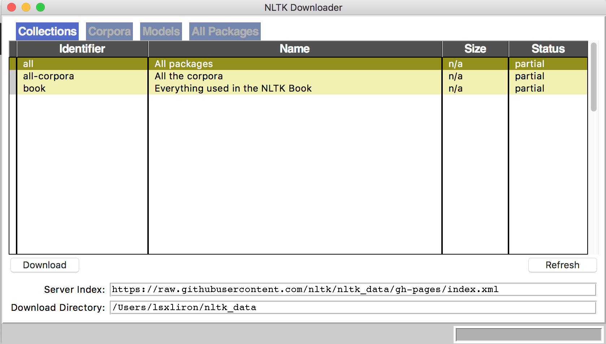

# Zahn Center Hackathon Starter Kit

Welcome to the *Zahn Center* Hackathon. This starter kit is intended to introduce you to some frameworks that might be helpful for you in order to solve your problem. Obviously, I won't be able to cover the full usage of each package and thus next to each package or framework name, you will find a link to the project website and documentation. 

Note that all the packages in this starter kit are only a suggestion and you are not restricted to them only. Feel free to use whatever will help you.

Good luck,

Liron Shimrony


**Note**: 
> The scripts and examples provided here were tested on a VM running **Ubuntu 16.04.1 32 bit** and MacOS Sierra however they suppose to work on any *nix machine


##Table of Contents
* [Development Environment](#development-environment)
    * [Introduction](#introduction)
    * [Installing PIP](#installing-pip)
    * [Create a Virtual Environment](#create-a-virtual-environment)
    * [Create Your Development Environment](#create-your-development-environment)
* [Database](#database)
    * [Installation](#installation)
    * [Create Users and Databases](#create-users-and-databases)
    * [Test Your Database](#test-your-database)
    * [Communicating with Python](#communicating-with-python)
* [Yahoo Finance](#yahoo-finance)
    * [Installation](#installation-1)
    * [Usage](#usage)
* [Web Servers](#web-servers)
* [ChatBot (ChatBot Project)](#chatbot)
    * [Installation](#installation-2)
    * [Usage](#usage-1)
* [Natural Language Processing Kit (Search Engine Project) ](#natural-language-processing-kit-nltk)
    * [Install NLTK](#install-nltk)
    * [Using NLTK](#using-nltk)
    * [Examples](#examples)
* [Sending emails (Mail Filter Project)](#sending-emails)
* [More libraries that might help](#more-libraries-that-might-help)

# Development Environment
## Introduction
It is important to have a stable development environment in order to use the development tools efficiently. My recommendation is to work with MacOS or any Debian distribution of Linux (e.g. Ubuntu). If you are working under Microsoft Windows, I recommend you to download [VirtualBox](https://www.virtualbox.org) and the latest version of [Ubuntu](https://www.ubuntu.com/download/desktop) before starting any development.
If you are working with Linux, you have the Aptitude package manager (apt-get) installed. In case you are working with a Mac, I would recommend you to install [HomeBrew](http://brew.sh). That way you want need to manually download and install each piece of software.

## Installing PIP
[PIP](https://pip.pypa.io/en/stable/) is a python package manager that will allow us to install different packages quickly. If you don't have it installed on you machine already, you can open shell and install it by running
```bash
sudo pip install python-pip
```
Mac users already have PIP pre-installed. 

## Create a Virtual Environment
In order to isolate our environment, we will install [VirtualEnv](https://virtualenv.pypa.io/en/stable/). This will promise that all the packages for your projects are isolated from the rest of the packages you already installed on your machine. You can install it by running `sudo pip install virtualenv` in your shell.

### Create Your Development Environment
After we installed VirtualEnv, navigate to your working directory (really doesn't matter which one you choose) and run the following command:
```bash
virtualenv [env_name] --no-site-packages
```

This command will create a directory called `env_name` which will be your virtual environment. Of course, replace `env_name` with the name you want to give your environment. For example: 
```bash
virtualenv zahnHackathon --no-site-packages
```

After the environment is created, we need to activate it by running:
```bash
source /path/to/env/bin/activate
```

If you created your environment on your desktop, it will be something like 
```bash
source ~/Desktop/zahnHackathon/bin/activate
```

Notice that your command prompt now displays the environment name in parenthesis.
In order to deactivate the environment just run `deactivate`

Now, when you have everything in place, we can start installing different packages that are required. 

# Database
For all the problems that you can choose from, a database is an essential part of the solution. My examples will use [MySQL](https://www.mysql.com) but everything will work the same if you decide to use other flavors of SQL (PostgreSQL, SQLite, etc.)

### Installation
- **Linux**- `sudo apt-get install mysql-server`
- **Mac**- `brew install mysql`

During the installation process you will need to type a password for MySQL root user

The last step is to activate the database service:

- If you are on Linux, you can do it by running `sudo service mysql start`
- For Mac users, run `mysql.server start`

### Create Users and Databases
After installing MySQL we need to create users so we can use the database. First, launch MySQL console as the root user:
```bash
mysql -u root -p
```

After typing your password, create a new user:

```sql
CREATE USER 'username'@'localhost' IDENTIFIED BY 'password';
GRANT ALL PRIVILEGES ON * . * TO 'username'@'localhost';
FLUSH PRIVILEGES;
exit;
```
Where you should replace `username` and `password` with your desired values.

### Test Your Database
To see that everything is working, run the following from your shell (replace `username` with the value you chose when you created the user)
```bash
mysql -u username -p
```

After typing your password you should be in the MySQL console.

If you managed to get to the console, your database is all set.

### Communicating with Python
In order to use MySQL in python, you must run the following from your shell
```bash
# This will install the tools the build the next packages (linux users only)
sudo apt-get install libmysqlclient-dev

# Install the MySQL python adapter (make sure your virtual environment is activated)
pip install mysql-python
```

# Yahoo Finance
For some of your projects, you will need to get some financial data. There are many APIs that provide this service. However I found that it is very convenient to work with [Yahoo Query Language (YQL)](https://developer.yahoo.com/yql/). Of course, this is just a suggestion and you can work with whatever fits your needs.

The [yahoo_finance](https://github.com/lukaszbanasiak/yahoo-finance) is a Python package that make it very easy to use this API and you do not need even to have a Yahoo account.

## Installation
```
pip install yahoo-finance
```

## Usage
```python
from yahoo_finance import Share

# Get data about Apple share
apple = Share('AAPL')

# Get the share price
print apple.get_price()
# OUTPUT: 116.16

# Since data is changing constantly, you can refresh the share and get the new data
apple.refresh()
print apple.get_price()
# OUTPUT: 116.3811

# You can access the full share dataset  
print apple.data_set

# OUTPUT:
'''
{'AfterHoursChangeRealtime': None,
 'AnnualizedGain': None,
 'Ask': '116.3900',
 'AskRealtime': None,
 'AverageDailyVolume': '36323300',
 'Bid': '116.3800',
 'BidRealtime': None,
 'BookValue': '23.4630',
 'Change': '-0.9589',
 'ChangeFromFiftydayMovingAverage': '5.3621',
 'ChangeFromTwoHundreddayMovingAverage': '12.9191',
 'ChangeFromYearHigh': '-7.4389',
 'ChangeFromYearLow': '26.9111',
 'ChangePercentRealtime': None,
 'ChangeRealtime': None,
 'Change_PercentChange': '-0.9589 - -0.8172%',
 'ChangeinPercent': '-0.8172%',
 'Commission': None,
 'Currency': 'USD',
 'DaysHigh': '117.2800',
 'DaysLow': '115.7200',
 'DaysRange': '115.7200 - 117.2800',
 'DaysRangeRealtime': None,
 'DaysValueChange': None,
 'DaysValueChangeRealtime': None,
 'DividendPayDate': '8/11/2016',
 'DividendShare': '2.2800',
 'DividendYield': '2.0000',
 'EBITDA': '73.96B',
 'EPSEstimateCurrentYear': '8.2600',
 'EPSEstimateNextQuarter': '3.1700',
 'EPSEstimateNextYear': '8.9600',
 'EarningsShare': '8.5760',
 'ErrorIndicationreturnedforsymbolchangedinvalid': None,
 'ExDividendDate': '8/4/2016',
 'FiftydayMovingAverage': '111.0190',
 'HighLimit': None,
 'HoldingsGain': None,
 'HoldingsGainPercent': None,
 'HoldingsGainPercentRealtime': None,
 'HoldingsGainRealtime': None,
 'HoldingsValue': None,
 'HoldingsValueRealtime': None,
 'LastTradeDate': '10/13/2016',
 u'LastTradeDateTimeUTC': '2016-10-13 15:24:00 UTC+0000',
 'LastTradePriceOnly': '116.3811',
 'LastTradeRealtimeWithTime': None,
 'LastTradeTime': '11:24am',
 'LastTradeWithTime': '11:24am - <b>116.3811</b>',
 'LowLimit': None,
 'MarketCapRealtime': None,
 'MarketCapitalization': '627.11B',
 'MoreInfo': None,
 'Name': 'Apple Inc.',
 'Notes': None,
 'OneyrTargetPrice': '126.1100',
 'Open': '116.7900',
 'OrderBookRealtime': None,
 'PEGRatio': '1.7500',
 'PERatio': '13.5706',
 'PERatioRealtime': None,
 'PercebtChangeFromYearHigh': '-6.0078%',
 'PercentChange': '-0.8172%',
 'PercentChangeFromFiftydayMovingAverage': '+4.8299%',
 'PercentChangeFromTwoHundreddayMovingAverage': '+12.4868%',
 'PercentChangeFromYearLow': '+30.0784%',
 'PreviousClose': '117.3400',
 'PriceBook': '5.0011',
 'PriceEPSEstimateCurrentYear': '14.0897',
 'PriceEPSEstimateNextYear': '12.9890',
 'PricePaid': None,
 'PriceSales': '2.8702',
 'SharesOwned': None,
 'ShortRatio': '1.5900',
 'StockExchange': 'NMS',
 'Symbol': 'AAPL',
 'TickerTrend': None,
 'TradeDate': None,
 'TwoHundreddayMovingAverage': '103.4620',
 'Volume': '17280203',
 'YearHigh': '123.8200',
 'YearLow': '89.4700',
 'YearRange': '89.4700 - 123.8200',
 'symbol': 'AAPL'}
'''


# Or just to access several data attributes
# For example, getting the price and currency
print "{} {}".format(apple.get_price(), apple.data_set['Currency'])

# OUTPUT: 116.3811 USD
```

# Web Servers
In order to make all your project components to work in harmony, you will need to use a web server (unless you want to create a stand-alone project). Please take a look on the two examples supplied:

- [Django example](https://github.com/lsxliron/Zahn-Center-Hackathon-Starter-Kit/tree/master/django_example)
- [Flask Example](https://github.com/lsxliron/Zahn-Center-Hackathon-Starter-Kit/tree/master/flask_example)

For your convenience, there is a boilerplate code for each framework:

 - [Django Boilerplate](https://github.com/lsxliron/Zahn-Center-Hackathon-Starter-Kit/tree/master/django_boilerplate)
 - [Flask Boilerplate](https://github.com/lsxliron/Zahn-Center-Hackathon-Starter-Kit/tree/master/flask_boilerplate)

The two examples have the same functionality of fetching a stock price and displaying it in HTML page, as well as storing the prices in a database. Another functionality is showing a table with the previous prices. 

# ChatBot
[ChatterBot](http://chatterbot.readthedocs.io/en/stable/index.html) is a chat bot package written in python. It has capabilities of integrating with SQL and NoSQL databases and it's quite easy to use. It can integrate with [MongoDB](https://www.mongodb.com) (you can read more about that in the [docs](http://chatterbot.readthedocs.io/en/stable/adapters/storage.html#mongo-database-adapter)) and also with [Django](https://www.djangoproject.com) (again, for specifications please take a look in the [docs](http://chatterbot.readthedocs.io/en/stable/django/index.html)).

## Installation
```
pip install chatterbot
```

## Usage
To create a basic bot:
```python
from chatterbot import ChatBot
from chatterbot.trainers import ChatterBotCorpusTrainer

# Create a chat bot called MegaBot
bot = ChatBot('MegaBot')

# Train the bot with some basic English
bot.set_trainer(ChatterBotCorpusTrainer)
bot.train('chatterbot.corpus.english')

# Let's give it a shot
res = bot.get_response('Good Morning!')
print res
# OUTPUT: I am doing well, how about you?


# Let's try something else
res = bot.get_response('Hello')
print res
# OUTPUT: Hi


# Another one
res = bot.get_response('Good Night!')
print res
# OUTPUT: I am doing well, how about you?
```

The last response doesn't make sense. The training dataset if very short and thus we need to add more data so the ChatBot will fit our purposes. We can use our own data for training. We can use a list where each item in the list is a possible response to its predecessor:

```python
from chatterbot.trainers import ListTrainer
bot.set_trainer(ListTrainer)

bot.train(["Good night", "Sweet dreams"])
res = bot.get_response("good night")
print res
# OUTPUT: Sweet dreams
```

You can also export your bot data to a file by running
```
bot.trainer.export_for_training('myData.json')
```

Note that the ChatBot will try to learn which response match to each request. You can disable the self learning by passing a `read_only=True` ([docs](http://chatterbot.readthedocs.io/en/stable/adapters/storage.html#read-only-mode)) as an argument when you instantiate the bot. 

To execute code using the chatbot, you can train it on a set of questions where the responses are function names to execute as a response to the question and render back the result.

# Natural Language Processing Kit (NLTK)

## Install NLTK
[NLTK](http://www.nltk.org) can be install using `pip` by running
```bash
pip install nltk
```

NLTK has an extensive amount of information that is not needed by all users. From that reason, after installing it, you will need to choose which sub packages to install.
Run you python shell and execute the following commands
```python
import nltk
nltk.download()
```

For Linux users, it will start the NLTK shell where you need to follow the instructions and download the packages. You can copy and paste the packages identifier from the list below.

For Mac users, this command will open the following window:

Just choose your desired packages

The following list contains recommended packages:

- Corpora
    + brown
    + twitter_samples
- Models
    + averaged_perceptron_tagger (Parts Of Speech tagging)
    + punkt (Words tokenizer)
    + tagsets (Help on tagsets)
    + universal_tagset (Parts Of Speech tagging)


## Using NLTK
This starter kit is way too short to describe all the capebilities of NLTK. You can read more about it on their [website](http://www.nltk.org). Here is a short example of a very basic usage.

When parsing a sentence, it is important to understand what are the verbs, nouns, adjectives, etc. Doing so, we can actually understand what the user is asking.

The first thing we should do with a text input is to strip it from all the punctuation and tokenize it (just create a list of words). After doing that, we can start finding the POS (parts of speech).

You can find the full list of POS by running the following command
```python
import nltk
nltk.help.upenn_tagset()
```

This will output a list with the POS and some examples.

## Examples
```python
import nltk
from nltk import word_tokenize, pos_tag
import string

# Get all the English alphabet letters and a space
valid_letters = string.letters + ' '
#############
# Example 1 #
#############

text = "Hello, how are you?"

# Remove all punctuation
stripped_text = ''.join([char if char in valid_letters else '' for char in text])
print stripped_text
# OUTPUT: 'Hello how are you'

# Tokenize
tokens = word_tokenize(stripped_text)
print tokens
# OUTPUT:  ['Hello', 'how', 'are', 'you']

# Get POS
tags = pos_tag(tokens)

'''
If you print the tags variable you will get the following output

[('Hello', 'NNP'), ('how', 'WRB'), ('are', 'VBP'), ('you', 'PRP')]
NNP = singular proper noun
WRB = WH adverb
VBP = verb, present tense, not 3rd person singular
PRP = pronoun, personal
'''


#############
# Example 2 #
#############

# We do the same process as before
text = "What is the value of Apple stock?"
stripped_text = ''.join([char if char in valid_letters else '' for char in text])
tokens = word_tokenize(stripped_text)
tags = pos_tag(tokens)

'''
If we print the tags variable:
[('What', 'WP'),
 ('is', 'VBZ'),
 ('the', 'DT'),
 ('value', 'NN'),
 ('of', 'IN'),
 ('Apple', 'NNP'),
 ('stock', 'NN')]
 '''
```

 The sentence in the second example has a bit more meaning than the previous one. We can see that we have 3 nouns: Apple (capitalize which might imply a proper noun ), value and stock. 
 Finding POS that way helps us to find the actual question and ignore any noise. The question *What is the value of Apple stock?* can be asked in different ways (when dealing with search engines):
 - Apple stock value
 - How much cost Apple stock
 - What is the price of Apple stock

The common thing for all the questions above are the words Apple and stock, which NLTK gave us without a lot of work.

# Sending Emails
If you would like to send an email from within the web app, you can do it easily by using [Flask-Mail](https://pythonhosted.org/Flask-Mail/) package (for Flask users) or the Django [send_mail](https://docs.djangoproject.com/en/1.10/topics/email/) function (for Django users)

# More libraries that might help
- [Numpy](http://www.numpy.org) - Scientific computing
- [sklearn](http://scikit-learn.org/stable/) - Machine learning
- [pandas](http://pandas.pydata.org) - Data analysis 
- [matplotlib](http://matplotlib.org) - Data visualization 
- [seaborn](https://seaborn.github.io) - Data visualization (easy to use)
- [reportlab](http://www.reportlab.com/documentation/) - Generate PDFs

<!-- TODO: sudo apt-get install libmysqlclient-dev-->
